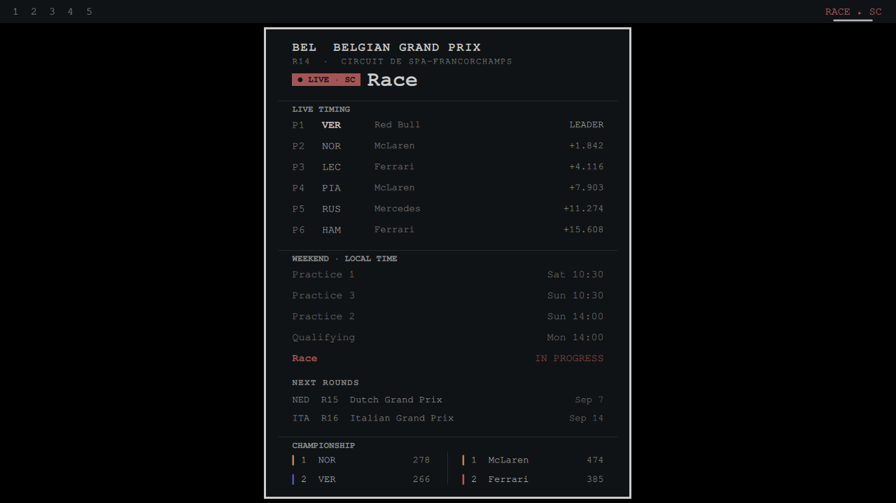

<p align="center"></p>

# Pit Wall

The next F1 session, counted down in your Omarchy bar. Live timing from the moment it starts.

A bar pill counts down to the next Formula 1 session, `QUALI 2h 14m`, then flips to live timing
the moment the lights go out. `RACE ▸ VER`, lit in your theme's active color. Click it for the
panel: the full weekend schedule in **your local time**, the live leaderboard with gaps to the
leader, and both championship standings.



[](https://ko-fi.com/U5S225PTME)

## Install

```bash
omarchy plugin add https://github.com/jeremylongshore/omarchy-pit-wall-entry --enable
```

Then add **Pit Wall** to your bar layout (Omarchy menu → Bar, or `~/.config/omarchy/shell.json`).

## What it shows

- **Between sessions.** Pill: next session plus a compact countdown (`FP1 2d 4h`). Panel: race
  name, round, circuit, every session of the weekend in local time (past sessions dimmed, the
  next one bold), plus the top of the drivers' and constructors' championships.
- **During a session.** Pill: session plus leader (`SPRINT ▸ NOR`) in the bar's active color, or
  the flag when it matters (`RACE ▸ SC`). Panel: live leaderboard with position, driver, team,
  and gap to the leader, refreshed every 20 seconds, above the schedule and standings.
- **Middle-click** the pill to force a refresh. `Esc` closes the panel, `Tab` walks to the
  neighboring panel, exactly like the built-in widgets.

## Where it pulls data: free, keyless, no accounts

Pit Wall makes read-only HTTPS GET requests to two public F1 APIs. No auth, no tokens, no
accounts, nothing sent anywhere. These are the only network calls it makes.

[jolpica-f1](https://github.com/jolpica/jolpica-f1) (`api.jolpi.ca`), the community successor to
the Ergast API, for the schedule and standings:

- `GET api.jolpi.ca/ergast/f1/current.json` (weekend schedule)
- `GET api.jolpi.ca/ergast/f1/current/driverstandings.json`
- `GET api.jolpi.ca/ergast/f1/current/constructorstandings.json`

[OpenF1](https://openf1.org) (`api.openf1.org`) for the live feed, polled only while a session is
running:

- `GET api.openf1.org/v1/sessions` (authoritative session window)
- `GET api.openf1.org/v1/drivers`
- `GET api.openf1.org/v1/position` (leaderboard order)
- `GET api.openf1.org/v1/intervals` (gaps to the leader)
- `GET api.openf1.org/v1/race_control` (flags, safety car)

Schedule and standings refresh every 15 minutes. Live polling only runs during a session window
and fetches incremental tails (the last few minutes of events), so the widget stays light even
across a full race distance. Every request is byte-capped so an oversized response can never
stall the shell.

## Zero configuration

There is no settings form. Pit Wall picks sensible defaults (15-minute schedule refresh, 20-second
live polling, 10 leaderboard rows, 5 standings rows) and shows the pill all season. The widget is
the configuration.

## Theming

No hardcoded colors. Everything reads the bar's palette (`foreground`, `urgent`, the panel
surfaces) and the shell's typography scale, so Pit Wall looks native in every Omarchy theme.

## Remove

```bash
omarchy plugin remove io.github.jeremylongshore.pit-wall
```

## Development

The data layer (`Model.js`) is pure functions shared between the QML runtime and node:

```bash
node --test tests/*.test.js
```

Fixtures under `tests/fixtures/` are real captured responses from both APIs.

## Maintainers wanted

These plugins are growing, and we are looking for dependable Omarchy users who
want to review issues, test releases, and keep a plugin healthy over time. Start
with a small pull request or [open a maintainer interest issue](https://github.com/jeremylongshore/omarchy-pit-wall-entry/issues/new?template=maintainer_interest.md&title=Maintainer%20interest%3A%20)
titled **Maintainer interest**. Tell us which plugin you use and how you want to
help. Consistent contributors can earn maintainer responsibility.

## License

MIT. See [LICENSE](LICENSE).
